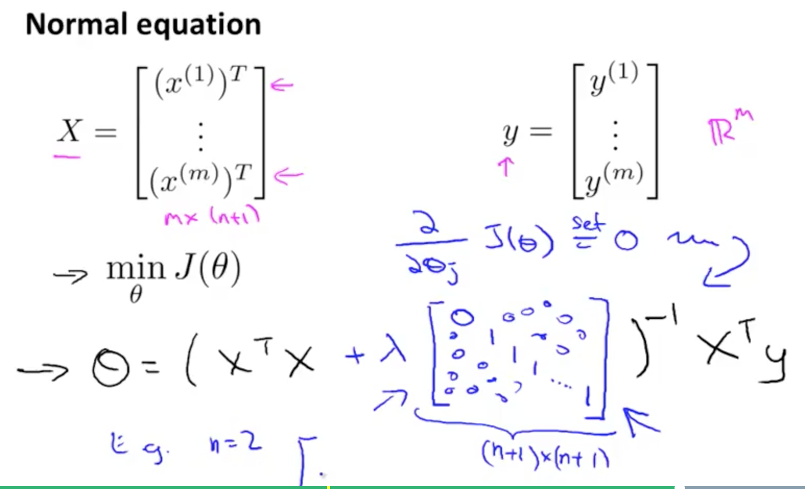
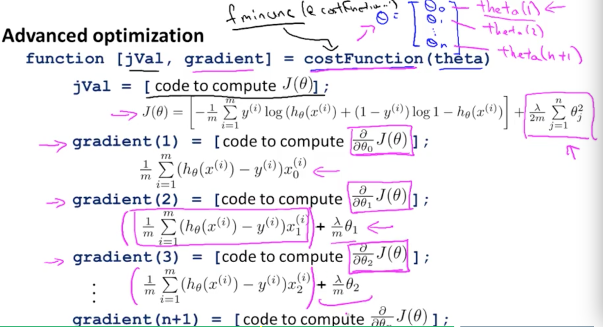

$y\in\{0,1\}$

逻辑回归  $0\leq h_\theta(x)\leq1$

$h_\theta(x)=P(y=1|x;\theta) | P(y=0|x;\theta)$

$h_\theta(x)=g^{(θ^Tx)}$

$z=θ^Tx$

$g_{(z)}=\frac{1}{1+e^{-z}}$

判定边界

为了得到凸函数损失函数

$Cost(h_\theta(x),y)=\begin{cases}-log(h_\theta(x)), &if\ y=1\\-log(1-h_\theta(x)), &if\ y=0\end{cases}$

$J(\theta)=\frac{1}{m}\sum_1^mCost(h_\theta(x^{(i)}),y^{(i)})=-\frac{1}{m}[\sum_1^my^{(i)}logh_\theta(x^{(i)})+(1-y^{(i)})log(1-h_\theta(x^{(i)}))]$

梯度下降：

目标：$min_\theta J(\theta)$

迭代：$\theta_j:=\theta_j-\alpha\frac{\delta}{\delta\theta_j}J(\theta)=\theta_j-\alpha\sum_1^m(h_\theta(x^{(i)})-y^{(i)})x_j^{(i)}$

形式上和线性回归相同但是这里的$h_\theta$是一个sigmoid函数

算法优化：共轭梯度法, BFGS, L-BFGS

多分类

$h_\theta^{(i)}=P(y=i|x;\theta)$ (i=1,2,3) 三组分类情况

目标：$max_ih_\theta^{(i)}(x)$  1-vs-all方法

欠拟合 过拟合：如何特征量很多 数据参考少的情况 可能引起过拟合，可以选择重要的特征量，或者采取正则化

$J(\theta)=\frac{1}{2m}[\sum_1^m(h_\theta(x^{(i)})-y^{(i)})^2+\lambda\sum_1^n\theta_j^2]$

$\lambda$太大会导致欠拟合 因为所有的$\theta$趋近于0

$\theta_j:=\theta_j(1-\alpha\frac{\lambda}{m})-\alpha\frac{1}{m}\sum_1^m(h_\theta(x^{(i)})-y^{(i)})x_j^{(i)}$

$1-\alpha\frac{\lambda}{m}<1$

逻辑回归正则

