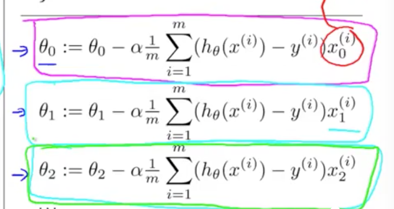

|房子大小(x)|价格(y)|
|-|:-:|-|
|2104|500|
|1000|400|
|800|350|
|.|.
|.|.

m: 数据样本数

(x,y)代表一个训练集

($x^{(i)},y^{(i)}$) 代表第几个数据

x->h->y

h代表了x映射到y的假设(hypothesis)函数:

h(x)=$\theta_0+\theta_1x$


损失函数:

$J_{(\theta_0,\theta_1)}=\frac{1}{2m}\sum_1^m(h(x^{(i)})-y^{(i)})^2$

梯度下降：

$\theta_j:=\theta_j-\alpha\frac{\delta J_{(\theta_0,\theta_1)}}{\delta \theta_j}$

多特征值(多项式线性回归)

|面积|卧房|楼层|年限|价格|
-|-|:-:|-|-
|2104|5|1|45|460|
|1416|3|2|40|232|
|1534|3|2|30|315|
|852|2|1|36|178|

n: 特征量 n=4

$x^{(i)}$: 第i个特征输入值 $x^{(2)}=\begin{matrix}&1416\\&3\\&2\\&40\end{matrix}$

$x_j^{(i)}$: 第j项特征的第i个值 $x_3^2=2$

$h_\theta^{(x)}=\theta_0x_0+\theta_1x_1+\theta_2x_2+\theta_3x_3+\theta_4x_4=\theta^\tau X$

为了方便，将$x_0$定义为1

梯度下降与单项回归相同：

均值化：
$x=\frac{x-\mu}{max(x)-min(x)}$

学习率：
$\alpha$ 0.001 0.003 0.01 0.03 1

正规方程：

$X=\begin{matrix}&1\\&x^{(i)}\end{matrix}$

$\theta=(X^{\tau}X)^{-1}X^{\tau}y$

